# Project ERD

This ERD is based on the Firestore-backed data model used across the Flutter app, Firestore rules, and Cloud Functions in this repository.

## Main Firestore ERD

```mermaid
erDiagram
    USERS {
        string userId PK
        string userEmail
        string userName
        string userHandle
        string userProfilePicture
        string userBio
        string userPhoneNumber
        string[] userSkills
        bool userIsVerified
        bool userIsPublic
        bool userAllowSearch
        bool userIsActive
        bool userIsBanned
        string[] fcmTokens
        timestamp userCreatedAt
        timestamp userLastLogin
        timestamp userLastActiveAt
        string userLocale
        string userTimezone
    }

    USER_STATS {
        string userId PK,FK
        int userBoardsCreatedCount
        int userBoardsDeletedCount
        int userTasksCreatedCount
        int userTasksCompletedCount
        int userTasksDeletedCount
        int userStepsCreatedCount
        int userStepsCompletedCount
        int userStepsDeletedCount
        int userTimeOnTasksMinutes
    }

    USER_DAILY_ACTIVITY {
        string userId PK,FK
    }

    USER_DAILY_ACTIVITY_DAY {
        string dateId PK
        string userId FK
        int tasksCreatedCount
        int tasksCompletedCount
        int tasksDeletedCount
        int stepsCreatedCount
        int stepsCompletedCount
        int stepsDeletedCount
        int focusMinutes
        int focusSessionsCount
        timestamp firstActivityAt
        timestamp lastActivityAt
    }

    BOARDS {
        string boardId PK
        string boardManagerId FK
        string boardManagerName
        string boardTitle
        string boardGoal
        string boardGoalDescription
        string boardDescription
        string boardType
        string boardPurpose
        bool boardIsPublic
        bool boardRequiresApproval
        bool boardIsDeleted
        timestamp boardCreatedAt
        timestamp boardDeletedAt
        int boardMemberLimit
        int boardTaskCapacity
        string[] memberIds
        map memberRoles
        map memberTaskLimits
        string[] pendingInviteUserIds
        string boardLastThoughtId
        timestamp boardLastModifiedAt
        string boardLastModifiedBy
        map stats
    }

    BOARD_ACTIVITIES {
        string activityId PK
        string boardId FK
        string userId FK
        string userName
        string activityType
        string description
        timestamp timestamp
        map metadata
    }

    TASKS {
        string taskId PK
        string taskBoardId FK
        string taskOwnerId FK
        string taskAssignedBy FK
        string taskAssignedTo FK
        string taskBoardTitle
        string taskOwnerName
        string taskAssignedToName
        string taskTitle
        string taskDescription
        string taskPriorityLevel
        string taskStatus
        string taskBoardLane
        string taskApprovalStatus
        string taskAssignmentStatus
        string taskProposedAssigneeId FK
        string taskProposedAssigneeName
        bool taskAllowsSubmissions
        bool taskRequiresSubmission
        bool taskRequiresApproval
        bool taskIsRepeating
        string taskRepeatInterval
        string taskRepeatTime
        bool taskIsDone
        bool taskFailed
        bool taskIsDeleted
        bool taskDeadlineMissed
        int taskExtensionCount
        string taskOutcome
        string[] taskDependencyIds
        string taskSubmissionId FK
        string taskLatestSubmissionThoughtId FK
        string taskRevisionOfTaskId FK
        string taskRevisionOfSubmissionId FK
        timestamp taskCreatedAt
        timestamp taskDeadline
        timestamp taskReminderSentAt
        timestamp taskIsDoneAt
        timestamp taskDeletedAt
        timestamp taskRepeatEndDate
        timestamp taskNextRepeatDate
        map taskStats
    }

    TASK_STATS {
        string taskId PK,FK
        int taskStepsCount
        int taskStepsDoneCount
        int taskStepsDeletedCount
        int taskEditsCount
        int deadlinesMissedCount
        int deadlinesExtendedCount
        int tasksFailedCount
    }

    STEPS {
        string stepId PK
        string parentTaskId FK
        string stepBoardId FK
        string stepOwnerId FK
        string stepAssignedBy FK
        string stepAssignedTo FK
        string stepBoardTitle
        string stepOwnerName
        string stepTitle
        string stepDescription
        bool stepIsDone
        bool stepIsDeleted
        int stepOrder
        int stepStatsAmountOfTimesEdited
        timestamp stepCreatedAt
        timestamp stepIsDoneAt
        timestamp stepDeletedAt
    }

    TASK_UPLOADS {
        string uploadId PK
        string taskId FK
        string boardId FK
        string uploadedByUserId FK
        string uploadedByUserName
        string fileName
        string fileUrl
        string filePublicId
        string fileExtension
        int fileSizeBytes
        bool isDeleted
        timestamp uploadedAt
        timestamp deletedAt
    }

    TASK_VOLUNTEER_REQUESTS {
        string requestId PK
        string taskId FK
        string boardId FK
        string userId FK
        string userName
        string status
        timestamp createdAt
        timestamp respondedAt
        string respondedBy FK
        string respondedByName
    }

    PLANS {
        string planId PK
        string planOwnerId FK
        string planOwnerName
        string planTitle
        string planDescription
        string planBenefit
        bool planIsDeleted
        bool planIsShared
        bool planIsTemplate
        string[] sharedWithUserIds
        string[] taskIds
        map taskOrder
        int totalTasks
        int completedTasks
        timestamp planCreatedAt
        timestamp planDeletedAt
        timestamp planDeadline
        timestamp planScheduledFor
    }

    THOUGHTS {
        string thoughtId PK
        string type
        string status
        string scopeType
        string boardId FK
        string taskId FK
        string authorId FK
        string authorName
        string targetUserId FK
        string targetUserName
        string title
        string message
        bool isDeleted
        timestamp createdAt
        timestamp updatedAt
        timestamp actionedAt
        string actionedBy FK
        string actionedByName
        map metadata
    }

    NOTIFICATIONS {
        string notificationId PK
        string recipientUserId FK
        string actorUserId FK
        string actorUserName
        string boardId FK
        string taskId FK
        string thoughtId FK
        string title
        string message
        string type
        string deliveryStatus
        string eventKey
        bool isRead
        bool isDeleted
        timestamp createdAt
        timestamp updatedAt
        timestamp readAt
        timestamp pushedAt
        map metadata
    }

    ACTIVITY_EVENTS {
        string eventId PK
        string userId FK
        string userName
        string userProfilePicture
        string activityType
        string boardId FK
        string taskId FK
        string description
        timestamp timestamp
        map metadata
    }

    MINDSET_SESSIONS {
        string sessionId PK
        string sessionUserId FK
        string sessionType
        string sessionMode
        string sessionFlowStyle
        string sessionTitle
        string sessionPurpose
        string sessionWhy
        string sessionStatus
        string sessionActiveTaskId FK
        string[] sessionTaskIds
        string[] sessionWorkedTaskIds
        timestamp sessionCreatedAt
        timestamp sessionStartedAt
        timestamp sessionEndedAt
        list sessionModeHistory
        list sessionActions
        map sessionStats
    }

    BOARD_JOIN_REQUESTS {
        string boardJoinRequestId PK
        string boardId FK
        string boardTitle
        string boardManagerId FK
        string boardManagerName
        string userId FK
        string userName
        string userProfilePicture
        string boardReqStatus
        string boardReqType
        string boardReqMessage
        timestamp boardReqCreatedAt
        timestamp boardReqRespondedAt
        string boardReqRespondedBy FK
        string boardReqResponseMessage
    }

    IN_APP_NOTIFICATIONS {
        string notificationId PK
        string userId FK
        string title
        string message
        string relatedId
        bool pushSent
        int pushAttempts
        timestamp pushAttemptedAt
        timestamp pushSentAt
        string pushLastError
        map metadata
    }

    PUSH_NOTIFICATIONS {
        string notificationId PK
        string userId FK
        string title
        string body
        bool isSent
        int attempts
        timestamp sentAt
        string lastError
        map data
    }

    USERS ||--|| USER_STATS : has
    USERS ||--|| USER_DAILY_ACTIVITY : owns_root
    USER_DAILY_ACTIVITY ||--o{ USER_DAILY_ACTIVITY_DAY : contains

    USERS ||--o{ BOARDS : manages
    BOARDS ||--o{ TASKS : contains
    BOARDS ||--o{ TASK_UPLOADS : scopes
    BOARDS ||--o{ TASK_VOLUNTEER_REQUESTS : receives
    BOARDS ||--o{ THOUGHTS : context_for
    BOARDS ||--o{ NOTIFICATIONS : context_for
    BOARDS ||--o{ ACTIVITY_EVENTS : context_for
    BOARDS ||--o{ BOARD_ACTIVITIES : logs
    BOARDS ||--o{ BOARD_JOIN_REQUESTS : receives

    USERS ||--o{ TASKS : owns
    USERS ||--o{ TASKS : assigned_to
    TASKS ||--|| TASK_STATS : has
    TASKS ||--o{ STEPS : breaks_into
    TASKS ||--o{ TASK_UPLOADS : has
    TASKS ||--o{ TASK_VOLUNTEER_REQUESTS : attracts
    TASKS ||--o{ THOUGHTS : context_for
    TASKS ||--o{ NOTIFICATIONS : context_for
    TASKS ||--o{ ACTIVITY_EVENTS : context_for
    TASKS ||--o{ TASKS : depends_on
    TASKS ||--o{ TASKS : revises

    USERS ||--o{ STEPS : owns
    USERS ||--o{ TASK_UPLOADS : uploads
    USERS ||--o{ TASK_VOLUNTEER_REQUESTS : creates
    USERS ||--o{ THOUGHTS : authors
    USERS ||--o{ THOUGHTS : targets
    USERS ||--o{ NOTIFICATIONS : receives
    USERS ||--o{ NOTIFICATIONS : triggers
    USERS ||--o{ ACTIVITY_EVENTS : produces
    USERS ||--o{ MINDSET_SESSIONS : runs
    USERS ||--o{ BOARD_JOIN_REQUESTS : sends_or_receives
    USERS ||--o{ IN_APP_NOTIFICATIONS : receives
    USERS ||--o{ PUSH_NOTIFICATIONS : receives

    PLANS }o--o{ TASKS : references_via_taskIds
    MINDSET_SESSIONS }o--o{ TASKS : references_via_sessionTaskIds
    NOTIFICATIONS }o--|| THOUGHTS : may_reference
```

## Embedded Structures

These are stored inside parent documents rather than as separate collections:

- `boards.stats` -> `BoardStats`
- `boards.memberRoles` -> `userId -> role`
- `boards.memberTaskLimits` -> `userId -> limit`
- `tasks.taskStats` -> embedded `TaskStats` snapshot, while `task_stats/{taskId}` also exists as a top-level doc
- `mindset_sessions.sessionStats` -> `MindSetSessionStats`
- `mindset_sessions.sessionModeHistory[]` -> `MindSetModeChange`
- `mindset_sessions.sessionActions[]` -> `MindSetSessionAction`

## Important Modeling Notes

- `BoardMember` exists as a Dart model, but there is no dedicated `board_members` collection in the current codebase. Membership is stored directly in `boards.memberIds`, `boards.memberRoles`, and `boards.memberTaskLimits`.
- `user_daily_activity` is modeled as a root document per user with a `days` subcollection: `user_daily_activity/{userId}/days/{yyyy-MM-dd}`.
- `boards/{boardId}/activities` exists in the Firestore rules, but current Flutter services mainly log board activity through the shared top-level `activity_events` collection.
- `plans` has extra fields implied by rules/services: `planIsShared`, `sharedWithUserIds`, and `planIsTemplate`. They are not yet present in the current `Plan` Dart model, so treat them as partially implemented schema.
- `board_join_requests`, `in_app_notifications`, and `push_notifications` appear in project docs and Cloud Functions, but they are not fully represented in the current Flutter-side data layer. They are included here because they are part of the repository's overall backend design.

## Source Basis

Primary sources used to derive this ERD:

- `firestore.rules`
- `functions/index.js`
- model files under `lib/**/datasources/models/`
- service files under `lib/**/datasources/services/`
- `BOARD_REQUEST_SYSTEM.md`
