# Project Use Cases

This document summarizes the major use cases of the Mind Manager project based on the current Flutter app, Firestore rules, and backend functions.

## Actors

- `Guest` - a person who has not signed in yet
- `Authenticated User` - a regular signed-in user
- `Board Member` - a user who belongs to a board
- `Board Supervisor` - a board member with elevated review/oversight permissions
- `Board Manager` - the owner/manager of a board
- `Firebase Auth` - external authentication provider
- `Cloudinary` - external file storage provider for uploads
- `Firebase Cloud Functions / FCM` - external notification delivery backend

## System Use Case Diagram

```mermaid
flowchart LR
    Guest[Guest]
    User[Authenticated User]
    Member[Board Member]
    Supervisor[Board Supervisor]
    Manager[Board Manager]
    Auth[Firebase Auth]
    Cloudinary[Cloudinary]
    FCM[Cloud Functions / FCM]

    subgraph MindManagerSystem[Mind Manager System]
        UC1((Register / Sign In))
        UC2((Manage Profile))
        UC3((View Dashboard))
        UC4((Manage Personal Boards))
        UC5((Create / Edit / Archive Boards))
        UC6((Invite or Remove Board Members))
        UC7((Request / Accept Board Access))
        UC8((Create / Assign / Update Tasks))
        UC9((Track Task Status))
        UC10((Volunteer for Tasks))
        UC11((Create and Manage Steps))
        UC12((Upload Task Files))
        UC13((Review Submissions))
        UC14((Create and Manage Plans))
        UC15((Run Mind:Set Sessions))
        UC16((Create Thoughts / Requests / Feedback))
        UC17((Receive Notifications))
        UC18((Search Users, Boards, Tasks))
        UC19((View Activity Logs and Stats))
        UC20((Delete Account / User Data))
    end

    Guest --> UC1
    Auth --> UC1

    User --> UC2
    User --> UC3
    User --> UC4
    User --> UC14
    User --> UC15
    User --> UC16
    User --> UC17
    User --> UC18
    User --> UC20

    Member --> UC7
    Member --> UC8
    Member --> UC9
    Member --> UC10
    Member --> UC11
    Member --> UC12
    Member --> UC16
    Member --> UC19

    Supervisor --> UC13
    Supervisor --> UC19

    Manager --> UC5
    Manager --> UC6
    Manager --> UC7
    Manager --> UC8
    Manager --> UC13
    Manager --> UC19

    Cloudinary --> UC12
    FCM --> UC17
```

## Main Use Cases

### 1. Authentication and Account Access

- `Guest` can register, sign in, and recover access through Firebase authentication.
- `Authenticated User` can sign out.
- `Authenticated User` can delete their account and associated Firestore data.

### 2. Profile Management

- `Authenticated User` can view their profile.
- `Authenticated User` can edit profile information such as name, bio, phone number, skills, and profile picture.
- `Authenticated User` can manage account settings and password.
- `Authenticated User` can control visibility and discoverability settings.

### 3. Dashboard and Personal Productivity

- `Authenticated User` can view dashboard summaries.
- `Authenticated User` can see productivity metrics, streaks, activity, and task engagement.
- `Authenticated User` can view daily activity and user statistics.

### 4. Board Management

- `Authenticated User` can automatically have a personal board.
- `Board Manager` can create team or personal boards.
- `Board Manager` can edit board details, capacity, purpose, and visibility.
- `Board Manager` can archive, restore, or delete boards.
- `Authenticated User` can browse boards they belong to.

### 5. Board Membership and Access Requests

- `Board Manager` can invite users to boards.
- `Authenticated User` can request access to public boards.
- `Authenticated User` can accept or decline board invitations.
- `Board Manager` can approve or reject join requests.
- `Board Manager` can remove members from a board.
- `Board Member` can leave a board.
- `Board Manager` can assign member roles such as `member` or `supervisor`.

### 6. Task Management

- `Authenticated User` can create personal tasks.
- `Board Manager` can create board tasks.
- `Board Manager` can assign tasks to members.
- `Board Member` can accept or decline assignments.
- `Board Member` can update task status such as `To Do`, `In Progress`, `Paused`, or `Submitted`.
- `Board Manager` and `Board Supervisor` can publish draft board tasks.
- `Board Manager` can edit, archive, restore, or delete tasks.
- `Board Member` can volunteer for available tasks.
- `Authenticated User` can manage repeating tasks, deadlines, dependencies, and revisions.

### 7. Step Management

- `Authenticated User` can create steps under tasks.
- `Board Member` can update or complete steps when they have access to the parent task.
- `Board Manager` and `Board Supervisor` can reorder, swap, edit, or remove steps.

### 8. Task Uploads and Submission Review

- `Board Member` can upload files for a task.
- `Board Member` can submit work for approval when a task requires submission.
- `Board Manager` and `Board Supervisor` can review uploaded work and submissions.
- `Board Manager` and `Board Supervisor` can approve, reject, or request changes.
- The system stores upload metadata and file links through `Cloudinary`.

### 9. Plans

- `Authenticated User` can create plans.
- `Authenticated User` can add tasks to plans.
- `Authenticated User` can remove or reorder plan tasks.
- `Authenticated User` can track plan progress through completed linked tasks.
- `Authenticated User` can archive plans.

### 10. Mind:Set Sessions

- `Authenticated User` can create a mindset session.
- `Authenticated User` can choose a session type such as `on_the_spot`, `go_with_flow`, or `follow_through`.
- `Authenticated User` can choose a working mode such as checklist or pomodoro.
- `Authenticated User` can add tasks to a session.
- `Authenticated User` can start, pause, switch, and complete session work.
- The system records session actions, worked tasks, and focus statistics.

### 11. Thoughts, Requests, and Collaboration Feedback

- `Authenticated User` can create thoughts or reminders.
- `Board Manager` can send board-related requests or invitations.
- `Board Member` can receive assignment-related and submission-related feedback.
- `Authenticated User` can resolve, accept, decline, or convert actionable thoughts depending on context.

### 12. Notifications

- The system can create in-app notifications tied to boards, tasks, or thoughts.
- `Authenticated User` can read, mark, or remove notifications.
- `Cloud Functions / FCM` can deliver push notifications to registered devices.

### 13. Search and Discovery

- `Authenticated User` can search discoverable users.
- `Authenticated User` can search visible boards.
- `Authenticated User` can search accessible tasks.

### 14. Activity Logs and Analytics

- The system logs activity events for boards, tasks, and user actions.
- `Authenticated User` can view personal activity summaries.
- `Board Manager` and `Board Supervisor` can inspect board-related activity and statistics.

## Include / Extend Style Relationships

These can help if you need a more formal UML use case discussion:

- `Create Board` includes `Initialize Board Stats`
- `Invite User to Board` may extend `Create Thought`
- `Approve Join Request` includes `Add Member to Board`
- `Create Task` includes `Create Task Stats`
- `Complete Task` may include `Complete Remaining Steps`
- `Upload Task File` includes `Store File in Cloudinary`
- `Create In-App Notification` may extend `Send Push Notification`
- `Start Mind:Set Session` includes `Record Session Stats`
- `Delete Account` includes `Delete User Stats`, `Delete Daily Activity`, `Delete Owned User Data`

## Suggested Thesis-Level Actor Summary

- `Guest` focuses on authentication entry points.
- `Authenticated User` handles personal productivity, plans, sessions, profile, and notifications.
- `Board Member` handles collaborative task execution.
- `Board Supervisor` handles monitoring and submission review.
- `Board Manager` handles governance, assignment, and board administration.
- External services support authentication, file storage, and notification delivery.
